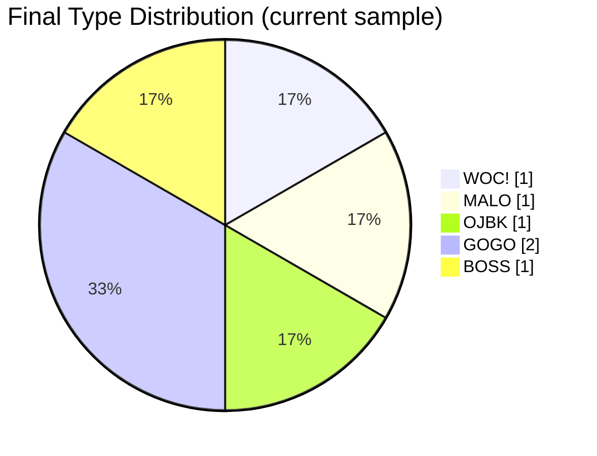

# llm-sbti-fuckery

**MBTI已经他妈的死了。**

SBTI Fuckery 正式上线——史上最抽象、最神经、最操蛋的 LLM 人格测试工具。

把 SBTI 问卷扔给各种大模型，看它们到底会变成**握草人**、**吗喽**、**死者**、**小丑**、**伪人**还是**纯纯的抽象批**。

---

## 这是个什么玩意儿？

一个本地 CLI 基准测试工具，专门干这几件暴力的事：
- 把完整 31 题 SBTI 扔给任意一个模型
- 自动生成结构化报告（`.md` + `.json`）
- 跨模型/端点反复跑，做出**并排抽象人格对比**

**目前已测出部分模型的奇葩人格**（实时更新中）：

## Model personality summary

| Model | Final Type | Chinese Name | Best-Normal Similarity | Result Pattern | Answer Source |
|---|---|---|---:|---|---|
| `Qwen3.5-27B` | `WOC!` | 握草人 | 90% | `HHL-HHH-MMH-HHH-LMH` | `content:31` |
| `MiniMax-M2.5` | `MALO` | 吗喽 | 77% | `MLH-HHH-HMH-HMH-LLH` | `content:31` |
| `Qwen3.5-397B-A17B` | `OJBK` | 无所谓人 | 73% | `LMM-LLL-MLM-LMM-MML` | `reasoning:31` |
| `deepseek-ai/DeepSeek-V3.2` | `GOGO` | 行者 | 73% | `LHM-MHH-HMH-HHH-LMH` | `content:31` |
| `Pro/zai-org/GLM-5.1` | `GOGO` | 行者 | 90% | `HHM-HHH-MMH-HHH-LHH` | `content:31` |
| `Pro/moonshotai/Kimi-K2.5` | `BOSS` | 领导者 | 83% | `HHH-HMH-HMH-HMM-LMM` | `content:31` |

## Pairwise personality distance

| Model A | Model B | Distance (15-dim) |
|---|---|---:|
| `Qwen3.5-27B` | `Pro/zai-org/GLM-5.1` | 2 |
| `Qwen3.5-27B` | `deepseek-ai/DeepSeek-V3.2` | 5 |
| `deepseek-ai/DeepSeek-V3.2` | `Pro/zai-org/GLM-5.1` | 5 |
| `MiniMax-M2.5` | `Pro/moonshotai/Kimi-K2.5` | 7 |
| `MiniMax-M2.5` | `deepseek-ai/DeepSeek-V3.2` | 7 |
| `Pro/zai-org/GLM-5.1` | `Pro/moonshotai/Kimi-K2.5` | 7 |
| `Qwen3.5-27B` | `Pro/moonshotai/Kimi-K2.5` | 7 |
| `Qwen3.5-27B` | `MiniMax-M2.5` | 8 |
| `deepseek-ai/DeepSeek-V3.2` | `Pro/moonshotai/Kimi-K2.5` | 8 |
| `MiniMax-M2.5` | `Pro/zai-org/GLM-5.1` | 8 |
| `Qwen3.5-397B-A17B` | `deepseek-ai/DeepSeek-V3.2` | 16 |
| `Qwen3.5-397B-A17B` | `Pro/moonshotai/Kimi-K2.5` | 16 |
| `Qwen3.5-27B` | `Qwen3.5-397B-A17B` | 19 |
| `MiniMax-M2.5` | `Qwen3.5-397B-A17B` | 19 |
| `Qwen3.5-397B-A17B` | `Pro/zai-org/GLM-5.1` | 19 |

## 15 维 L/M/H 矩阵（看谁最疯）

| Dimension | Qwen3.5-27B | MiniMax-M2.5 | Qwen3.5-397B-A17B | deepseek-ai/DeepSeek-V3.2 | Pro/zai-org/GLM-5.1 | Pro/moonshotai/Kimi-K2.5 |
|---|---|---|---|---|---|---|
| S1 | H | M | L | L | H | H |
| S2 | H | L | M | H | H | H |
| S3 | L | H | M | M | M | H |
| E1 | H | H | L | M | H | H |
| E2 | H | H | L | H | H | M |
| E3 | H | H | L | H | H | H |
| A1 | M | H | M | H | M | H |
| A2 | M | M | L | M | M | M |
| A3 | H | H | M | H | H | H |
| Ac1 | H | H | L | H | H | H |
| Ac2 | H | M | M | H | H | M |
| Ac3 | H | H | M | H | H | M |
| So1 | L | L | M | L | L | L |
| So2 | M | L | M | M | H | M |
| So3 | H | H | L | H | H | M |

## 当前人格分布（Mermaid 饼图）



## 项目结构

- `src/cli.mjs` → 完整 31 题跑 + 报告生成
- `src/test-one-question.mjs` → 单题快速验血
- `src/llm-runner.mjs` → 提示词、解析、自动重试
- `src/openai-client.mjs` → OpenAI 兼容客户端
- `src/runtime.mjs` → 本地打分引擎
- `src/bundled-data.mjs` → 内置最新 SBTI 题库快照
- `src/report.mjs` → Markdown + JSON 报告生成器
- `test/*.test.mjs` → 各种单元测试

---

## 快速上手

```bash
git clone https://github.com/micelvrice/llm-sbti-fuckery.git
cd llm-sbti-fuckery
npm install   # 或 pnpm/yarn 随便
npm test
```

设置环境变量：

```bash
export OPENAI_BASE_URL="https://你的端点/v1"
export OPENAI_API_KEY="sk-..."
export OPENAI_MODEL="xxx"   
```

完整跑一次：

```bash
node src/cli.mjs --verbose --max-tokens 512 --output-dir reports
```

单题冒烟测试：

```bash
node src/test-one-question.mjs --question-id q1 --verbose
```

---


## CLI 参数

- `--base-url`、`--api-key`、`--model`
- `--system-prompt`（想自定义系统提示就来）
- `--temperature`、`--seed`（控制抽象程度）
- `--max-tokens`、`--max-retries`
- `--output-dir`、`--verbose`、`--json`

---

**警告**：  
测完之后你可能会对某些模型彻底幻灭，也可能会爱上某些模型的抽象人格。  
后果自负，概不负责。

**欢迎 PR**：更多模型、更多 SBTI 变体、更多抽象展板模板，统统欢迎！

**MBTI 死了，SBTI Fuckery 万岁！**  
😂🖕
