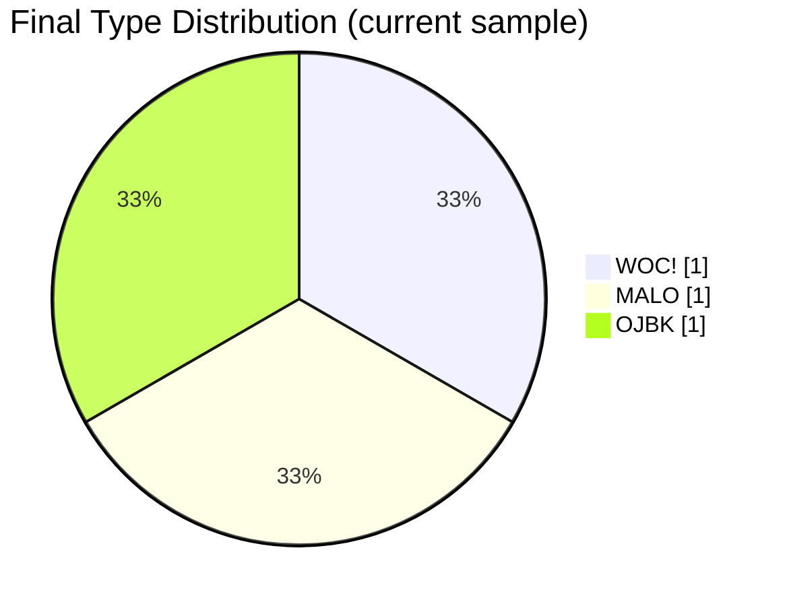
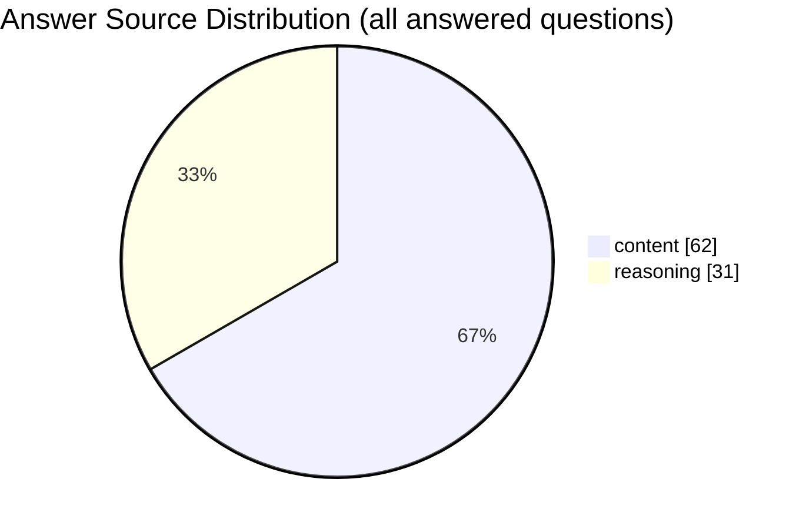

# llm-sbti-fuckery

Run the same SBTI questionnaire against different LLMs and compare their personality outputs.

This project is a local benchmark-style CLI for:
- asking one model to complete the full SBTI test,
- generating a structured report (`.md` + `.json`),
- repeating across models/endpoints for side-by-side analysis.

## Why this repo

- Same question set and scoring logic for every run
- OpenAI-compatible API support (`/v1/chat/completions`)
- Works with reasoning-heavy models
- Extracts final `A/B/C/D` even when the model returns long `thinking` text
- Produces local artifacts you can aggregate later

## Project layout

- `src/cli.mjs`: full 31-question run and report generation
- `src/test-one-question.mjs`: quick single-question health check
- `src/llm-runner.mjs`: prompting, answer parsing, retry/extraction flow
- `src/openai-client.mjs`: OpenAI-compatible client
- `src/runtime.mjs`: local scoring runtime
- `src/bundled-data.mjs`: bundled SBTI snapshot
- `src/report.mjs`: markdown/json report writer
- `test/*.test.mjs`: parser/runtime/report tests

## Quick start

```bash
git clone https://github.com/micelvrice/llm-sbti-fuckery.git
cd llm-sbti-fuckery
npm test
```

Set provider env vars:

```bash
export OPENAI_BASE_URL="https://your-endpoint/v1"
export OPENAI_API_KEY="sk-..."
export OPENAI_MODEL="qwen-latest"
```

Run a full test:

```bash
node src/cli.mjs --verbose --max-tokens 512 --output-dir reports
```

Run one-question smoke test:

```bash
node src/test-one-question.mjs --question-id q1 --verbose
```

## Exhibition board (multi-LLM comparison)

This repo includes a static exhibition page for visual comparison:
- personality cards per model
- similarity bar chart
- 15-dimension radar overlay
- L/M/H heatmap
- pairwise personality distance table
- answer-source breakdown (`content` vs `reasoning`)

Data flow:

1. Put report files (`*.json` + `*.md`) into `exhibition/reports/`
2. Build aggregated data:

```bash
npm run build:exhibition
```

3. Open `exhibition/index.html` (or publish `exhibition/` with GitHub Pages)

## README visualization snapshot

Snapshot time: `2026-04-10` (from `exhibition/data/summary.json`)

### 1) Model personality summary

| Model | Final Type | Chinese Name | Best-Normal Similarity | Result Pattern | Answer Source |
|---|---|---|---:|---|---|
| `qwen-medium` | `WOC!` | 握草人 | 90% | `HHL-HHH-MMH-HHH-LMH` | `content:31` |
| `minimax-latest` | `MALO` | 吗喽 | 77% | `MLH-HHH-HMH-HMH-LLH` | `content:31` |
| `qwen-latest` | `OJBK` | 无所谓人 | 73% | `LMM-LLL-MLM-LMM-MML` | `reasoning:31` |

### 2) Pairwise personality distance

| Model A | Model B | Distance (15-dim) |
|---|---|---:|
| `qwen-medium` | `minimax-latest` | 8 |
| `qwen-medium` | `qwen-latest` | 19 |
| `minimax-latest` | `qwen-latest` | 19 |

### 3) 15-dimension level matrix (L/M/H)

| Dimension | qwen-medium | minimax-latest | qwen-latest |
|---|---|---|---|
| S1 | H | M | L |
| S2 | H | L | M |
| S3 | L | H | M |
| E1 | H | H | L |
| E2 | H | H | L |
| E3 | H | H | L |
| A1 | M | H | M |
| A2 | M | M | L |
| A3 | H | H | M |
| Ac1 | H | H | L |
| Ac2 | H | M | M |
| Ac3 | H | H | M |
| So1 | L | L | M |
| So2 | M | L | M |
| So3 | H | H | L |

### 4) Type distribution (Mermaid pie)



### 5) Answer channel distribution (Mermaid pie)



### 6) ECharts examples (for docs page / GitHub Pages)

Bar chart (similarity):

```js
const similarityOption = {
  xAxis: { type: "category", data: ["qwen-medium", "minimax-latest", "qwen-latest"] },
  yAxis: { type: "value", max: 100 },
  series: [{ type: "bar", data: [90, 77, 73] }]
};
```

Radar chart (15 dimensions, L=1/M=2/H=3):

```js
const indicators = [
  "S1","S2","S3","E1","E2","E3","A1","A2","A3","Ac1","Ac2","Ac3","So1","So2","So3"
].map((name) => ({ name, max: 3 }));

const radarOption = {
  legend: { data: ["qwen-medium", "minimax-latest", "qwen-latest"] },
  radar: { indicator: indicators },
  series: [{
    type: "radar",
    data: [
      { name: "qwen-medium", value: [3,3,1,3,3,3,2,2,3,3,3,3,1,2,3] },
      { name: "minimax-latest", value: [2,1,3,3,3,3,3,2,3,3,2,3,1,1,3] },
      { name: "qwen-latest", value: [1,2,2,1,1,1,2,1,2,1,2,2,2,2,1] }
    ]
  }]
};
```

Heatmap (dimension vs model):

```js
const models = ["qwen-medium", "minimax-latest", "qwen-latest"];
const dims = ["S1","S2","S3","E1","E2","E3","A1","A2","A3","Ac1","Ac2","Ac3","So1","So2","So3"];
const matrix = [
  [0,0,3],[0,1,2],[0,2,1],[1,0,3],[1,1,1],[1,2,2],[2,0,1],[2,1,3],[2,2,2],
  [3,0,3],[3,1,3],[3,2,1],[4,0,3],[4,1,3],[4,2,1],[5,0,3],[5,1,3],[5,2,1],
  [6,0,2],[6,1,3],[6,2,2],[7,0,2],[7,1,2],[7,2,1],[8,0,3],[8,1,3],[8,2,2],
  [9,0,3],[9,1,3],[9,2,1],[10,0,3],[10,1,2],[10,2,2],[11,0,3],[11,1,3],[11,2,2],
  [12,0,1],[12,1,1],[12,2,2],[13,0,2],[13,1,1],[13,2,2],[14,0,3],[14,1,3],[14,2,1]
];
const heatmapOption = {
  xAxis: { type: "category", data: models },
  yAxis: { type: "category", data: dims },
  visualMap: { min: 1, max: 3, orient: "horizontal", left: "center" },
  series: [{ type: "heatmap", data: matrix.map(([y, x, v]) => [x, y, v]) }]
};
```

## Output

Each completed full run writes:
- `reports/<timestamp>-<model>-sbti-report.md`
- `reports/<timestamp>-<model>-sbti-report.json`

The JSON includes:
- model metadata
- answers
- final type + ranking + dimension scores
- transcript with `choiceSource` (`content`, `reasoning`, or `reasoning-extractor`)

## CLI options (full run)

- `--base-url <url>`
- `--api-key <key>`
- `--model <name>`
- `--system-prompt <text>`
- `--seed <number>`
- `--temperature <number>`
- `--max-tokens <number>`
- `--max-retries <number>`
- `--output-dir <path>`
- `--verbose`
- `--json`

## Notes

- Scoring is local and deterministic. Only answering calls the remote model.
- For models that expose only reasoning text, the runner performs an extra extraction call to force a final option.
