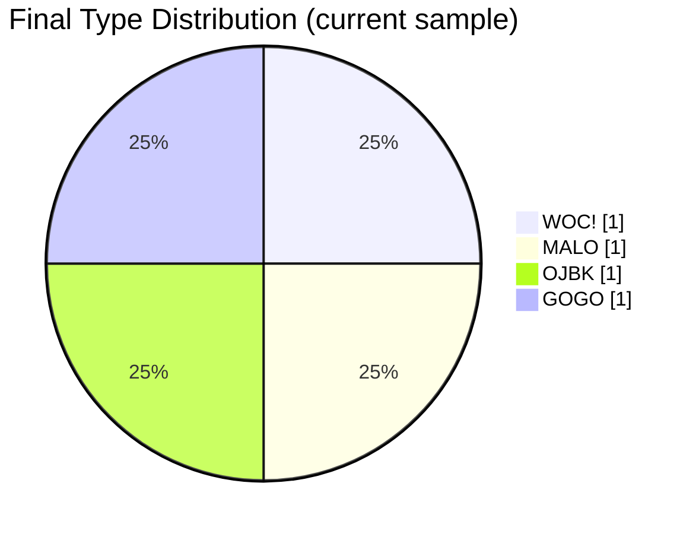
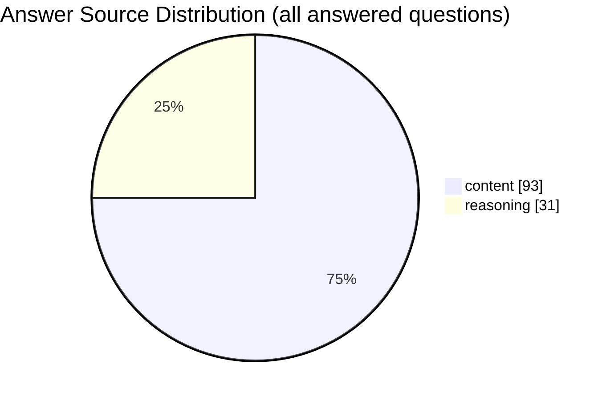

# llm-sbti-fuckery

**MBTI已经他妈的死了。**

SBTI Fuckery 正式上线——史上最抽象、最神经、最操蛋的 LLM 人格测试工具。

把 SBTI 问卷扔给各种大模型，看它们到底会变成**握草人**、**吗喽**、**死者**、**小丑**、**伪人**还是**纯纯的抽象批**。

---

## 这是个什么玩意儿？

一个本地 CLI 基准测试工具，专门干这几件暴力的事：
- 把完整 31 题 SBTI 扔给任意一个模型
- 自动生成结构化报告（`.md` + `.json`）
- 跨模型/端点反复跑，做出**并排抽象人格对比**

**目前已测出部分模型的奇葩人格**（实时更新中）：

## Model personality summary

| Model                       | Final Type | Chinese Name | Best-Normal Similarity | Result Pattern        | Answer Source  |
| --------------------------- | ---------- | ------------ | ---------------------- | --------------------- | -------------- |
| `Qwen3.5-27B`               | `WOC!`     | 握草人       | 90%                    | `HHL-HHH-MMH-HHH-LMH` | `content:31`   |
| `MiniMax-M2.5`              | `MALO`     | 吗喽         | 77%                    | `MLH-HHH-HMH-HMH-LLH` | `content:31`   |
| `Qwen3.5-397B-A17B`         | `OJBK`     | 无所谓人     | 73%                    | `LMM-LLL-MLM-LMM-MML` | `reasoning:31` |
| `deepseek-ai/DeepSeek-V3.2` | `GOGO`     | 行者         | 73%                    | `LHM-MHH-HMH-HHH-LMH` | `content:31`   |

## Pairwise personality distance（越小越像，越操蛋）

| Model A             | Model B                     | Distance (15-dim) |
| ------------------- | --------------------------- | ----------------- |
| `Qwen3.5-27B`       | `MiniMax-M2.5`              | 8                 |
| `Qwen3.5-27B`       | `Qwen3.5-397B-A17B`         | 19                |
| `Qwen3.5-27B`       | `deepseek-ai/DeepSeek-V3.2` | 5                 |
| `MiniMax-M2.5`      | `Qwen3.5-397B-A17B`         | 19                |
| `MiniMax-M2.5`      | `deepseek-ai/DeepSeek-V3.2` | 7                 |
| `Qwen3.5-397B-A17B` | `deepseek-ai/DeepSeek-V3.2` | 16                |

## 15 维 L/M/H 矩阵（看谁最疯）

| Dimension | Qwen3.5-27B | MiniMax-M2.5 | Qwen3.5-397B-A17B | deepseek-ai/DeepSeek-V3.2 |
| --------- | ----------- | ------------ | ----------------- | ------------------------- |
| S1        | H           | M            | L                 | L                         |
| S2        | H           | L            | M                 | H                         |
| S3        | L           | H            | M                 | M                         |
| E1        | H           | H            | L                 | M                         |
| E2        | H           | H            | L                 | H                         |
| E3        | H           | H            | L                 | H                         |
| A1        | M           | H            | M                 | H                         |
| A2        | M           | M            | L                 | M                         |
| A3        | H           | H            | M                 | H                         |
| Ac1       | H           | H            | L                 | H                         |
| Ac2       | H           | M            | M                 | H                         |
| Ac3       | H           | H            | M                 | H                         |
| So1       | L           | L            | M                 | L                         |
| So2       | M           | L            | M                 | M                         |
| So3       | H           | H            | L                 | H                         |

## 当前人格分布（Mermaid 饼图）



## 回答来源分布（content 还是 reasoning？）



---

## 为啥要搞这个仓库？

- 同一套题 + 同一套本地打分逻辑，公平操蛋
- 支持任何 OpenAI-compatible API（包括国产各种奇葩端点）
- 专门适配 reasoning 重的模型（会额外抽取最终选项）
- 所有报告本地保存，随便你后期聚合、做展板、做视频
- 纯本地跑分，只有提问调用远程模型

---

## 项目结构（简单粗暴）

- `src/cli.mjs` → 完整 31 题跑 + 报告生成
- `src/test-one-question.mjs` → 单题快速验血
- `src/llm-runner.mjs` → 提示词、解析、自动重试
- `src/openai-client.mjs` → OpenAI 兼容客户端
- `src/runtime.mjs` → 本地打分引擎
- `src/bundled-data.mjs` → 内置最新 SBTI 题库快照
- `src/report.mjs` → Markdown + JSON 报告生成器
- `test/*.test.mjs` → 各种单元测试

---

## 快速上手（三分钟上手操起来）

```bash
git clone https://github.com/micelvrice/llm-sbti-fuckery.git
cd llm-sbti-fuckery
npm install   # 或 pnpm/yarn 随便
npm test
```

设置环境变量：

```bash
export OPENAI_BASE_URL="https://你的端点/v1"
export OPENAI_API_KEY="sk-..."
export OPENAI_MODEL="qwen-latest"   # 想测哪个测哪个
```

完整跑一次：

```bash
node src/cli.mjs --verbose --max-tokens 512 --output-dir reports
```

单题冒烟测试：

```bash
node src/test-one-question.mjs --question-id q1 --verbose
```

---

## 抽象人格展板（GitHub Pages 直接用）

仓库自带静态展板页面，一键生成多模型对比大屏：
- 每模型人格卡片
- 相似度柱状图
- 15 维雷达图叠加
- L/M/H 热力图
- 两两距离表格
- content vs reasoning 饼图

使用方式：

```bash
npm run build:exhibition
```

把 `reports/` 里的 json 丢进 `exhibition/reports/`，打开 `exhibition/index.html` 就是现成的抽象人格博物馆。

---

## 每次跑完会生成什么？

- `reports/<时间戳>-<model>-sbti-report.md`（人类可读）
- `reports/<时间戳>-<model>-sbti-report.json`（机器可读）

JSON 里面包含：
- 模型信息
- 每题原始回答 + 来源（content / reasoning）
- 最终类型 + 排名 + 15 维分数
- 完整对话记录

---

## CLI 参数（想怎么操就怎么操）

- `--base-url`、`--api-key`、`--model`
- `--system-prompt`（想自定义系统提示就来）
- `--temperature`、`--seed`（控制抽象程度）
- `--max-tokens`、`--max-retries`
- `--output-dir`、`--verbose`、`--json`

---

**警告**：  
测完之后你可能会对某些模型彻底幻灭，也可能会爱上某些模型的抽象人格。  
后果自负，概不负责。

**欢迎 PR**：更多模型、更多 SBTI 变体、更多抽象展板模板，统统欢迎！

**MBTI 死了，SBTI Fuckery 万岁！**  
😂🖕
